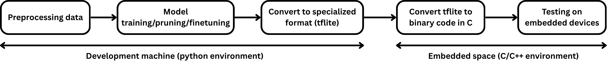
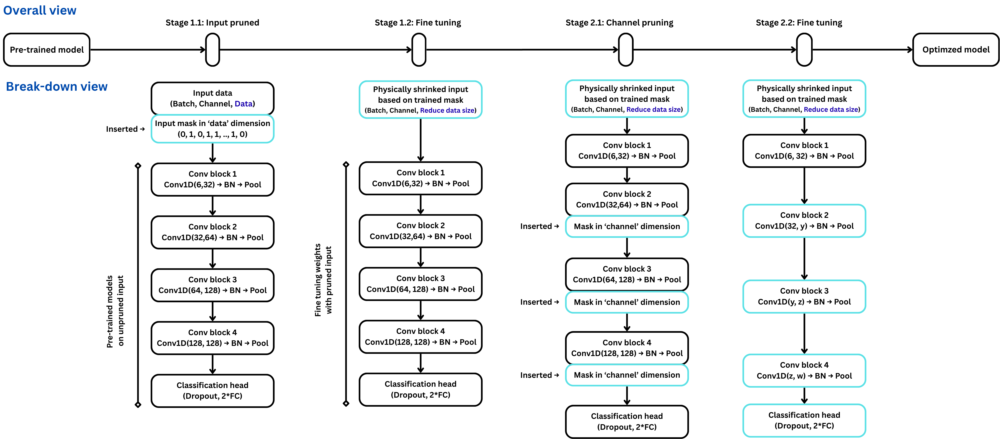

# Efficient Multi-Stage Pruning for Human Activity Recognition (HAR)

## Overview
This repository provides a complete experimental framework aimed at building lightweight yet highly efficient neural networks for wearable sensors. Focusing on HAR tasks, the project applies an advanced pruning technique (using Gumbel-Softmax as a masking function) to identify the optimal input features and convolution channels needed to retain baseline performance.

It evaluates these concepts on open-sourced datasets ([UCI-HAR](https://archive.ics.uci.edu/dataset/240/human+activity+recognition+using+smartphones) and [WEAR](https://mariusbock.github.io/wear/)) using a LOSO cross-validation methodology, culminating in post-training optimized conversions to TensorFlow Lite for deployment on an STM32F4 MCU.

## Experiment Configuration
The input size per axis is 100 samples for the WEAR dataset (50 Hz, 2 s) and 128 samples for the UCI-HAR dataset. When utilizing all 6 axes, the input tensor shapes are (1, 100, 6) and (1, 128, 6), respectively.

| Dataset  | Activity      | Classes | Channels               | Window (s) | Overlap | Number of subjects |
|----------|--------------:|--------:|------------------------|-----------:|--------:|-------------------:|
| WEAR     | Sport         |       8 | 6 (Left+Right Acc)     | 2.00       | 50%     | 30                 |
| UCI-HAR  | Daily living  |       6 | 6 (Acc+Gyro)           | 2.56       | 50%     | 24                 |

The model leverages Depthwise Separable Convolutions to maintain a low parameter count. The baseline model has approximately 37k parameters, which will be further pruned to be around 18k parameters. The detailed model architecture is discussed in [model_arch](docs/model_arch.md).

The network is trained using the Adam optimizer with a learning rate of 1e-3, a weight decay of 1e-6, a batch size of 64, and a weighted cross-entropy loss function. Additionally, Gumbel τ is initially set to 10 and gradually decays to 0 as the network reaches convergence. 

## Results
With this pruning method, we achieved inference speeds 3.5 times faster than the baseline, using only half of the RAM and Flash memory, while maintaining a slightly higher performance

| Pre-processing | Input ratio   | Model param. ratio | Accuracy (F32)            | F1 (F32)                 | Accuracy (W8A16)         | F1 (W8A16)               |Inference (ms)            | RAM (KB)                    | ROM (KB)                     | 
|:---------------|:-----------------|:-------------------------|:-----------------------------|:----------------------------|:----------------------------|:----------------------------|:----------------------------|:----------------------------|:-----------------------------|
| Baseline-TD    | 1.000            | 1.000                    | 80.94 ±2.13    | 71.80 ±3.13   | 80.92 ±2.31   | 72.07 ±2.33   | 80.91 ±0.01   | 22.87 ±0.00   | 162.27 ±0.00   |
| DCT            | 1.000            | 1.000                    | 77.78 ±3.81    | 68.11 ±1.91   | 77.41 ±4.12   | 67.92 ±2.14   | 80.90 ±0.01   | 22.87 ±0.00   | 162.27 ±0.00   |
| Pruned-DCT     | 0.424            | 0.498                    | 79.03 ±0.98    | 68.36 ±1.07   | 79.00 ±1.00   | 68.35 ±1.07   | 24.72 ±6.57   |**11.22 ±1.79**| 86.02 ±12.22   |
| IHW            | 1.000            | 1.000                    | 81.09 ±2.24    | 72.07 ±1.26   | 81.08 ±2.26   | 72.07 ±1.28   | 80.91 ±0.01   | 22.87 ±0.00   | 162.27 ±0.00   |
| Pruned-IHW     | 0.490            | 0.555                    | **81.62 ±0.63**|**72.30 ±0.57**|**81.56 ±0.64**|**72.27 ±0.56**|**22.15 ±5.77**| 11.63 ±2.20   |**74.19 ±13.34**|

Annotation
- `TD`: Time domain data; `FFT`: Fast Fourier Transform; `DCT`: Discrete Cosine Transform; `IHW`: Integer Haar Wavelet
- `F32`: 32-bit floating-point weights and activations; `W8A16`: 8-bit integer weights and 16-bit integer activations
- `Input ratio`: Ratio of the pruned input size to the default input size. For example, an `Input ratio` of 0.424 means that if the default model has 100 input frequency bins, the pruned model uses an average of only 42 frequency bins to achieve comparable performance. This helps reduce the model's inference time and RAM usage on edge devices.
- `Model param. ratio`: Ratio of the pruned model parameters to the default model parameters. For example, a `Model param. ratio` of 0.5 means that if the default model has 100,000 parameters, the pruned model requires only 50,000 parameters to achieve comparable performance. This significantly reduces the model's flash usage and computational load.
<!-- 
## MCU demonstration
TODO -->

## Methodologies

**Methodologies**:
- **Data Preprocessing**: Preprocessing techniques including raw time-domain signals, Fast Fourier Transform (FFT), Discrete Cosine Transform (DCT), and Integer Haar Wavelet (IHW). 
- **Validation Scheme:**: Leave-One-Subject-Out (LOSO) ensures eneralization.
- **Gumbel-Softmax Pruning Sequences**:
  - **Input Pruning**: Identifies and drops uninformative frequency bins (FFT/DCT/IHW) via a learnable mask.
  - **Channel Pruning**: Dynamically removes unused convolutional channels during training.
- **TFLite Post-Training Quantization (PTQ)**: Provides a deployment-ready pipeline (`PyTorch .pth` → `ONNX` → `TF SavedModel` via `onnx2tf` → `.tflite`). Target quantization format is `W8A16_INT_IO`
- **Profiling**: Measure predictive and efficiency metrics on STM32 MCUs.

**Training Pipeline**
